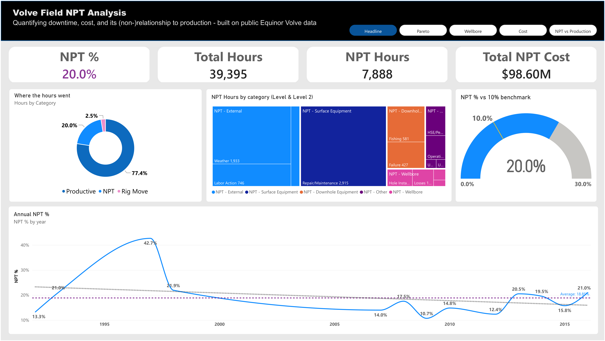
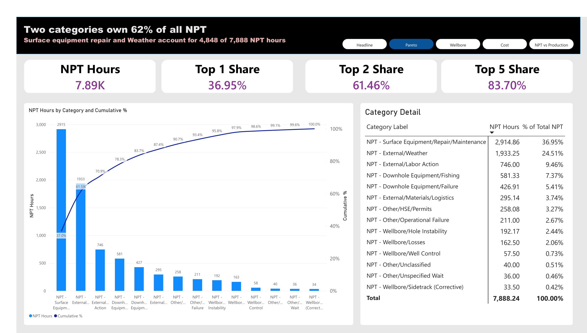
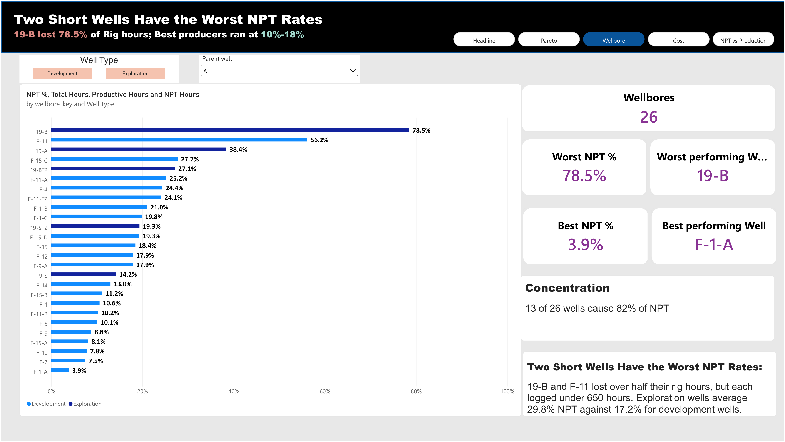
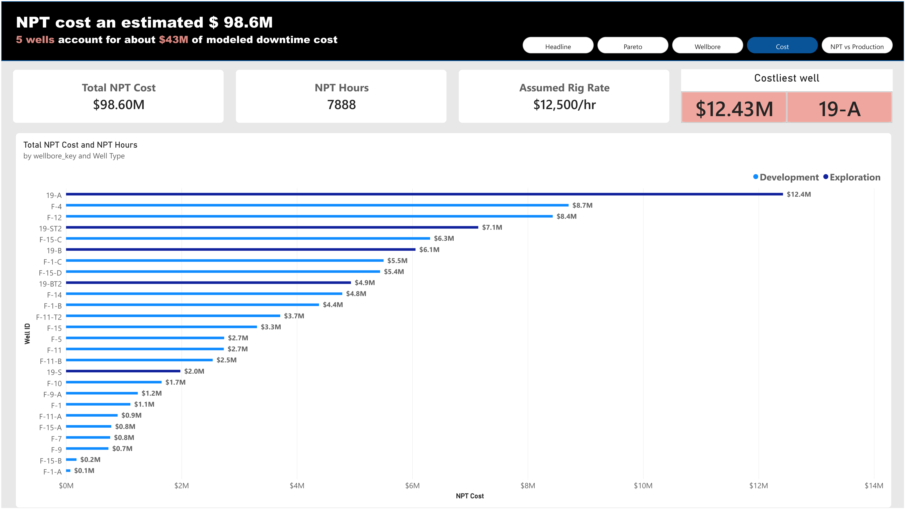
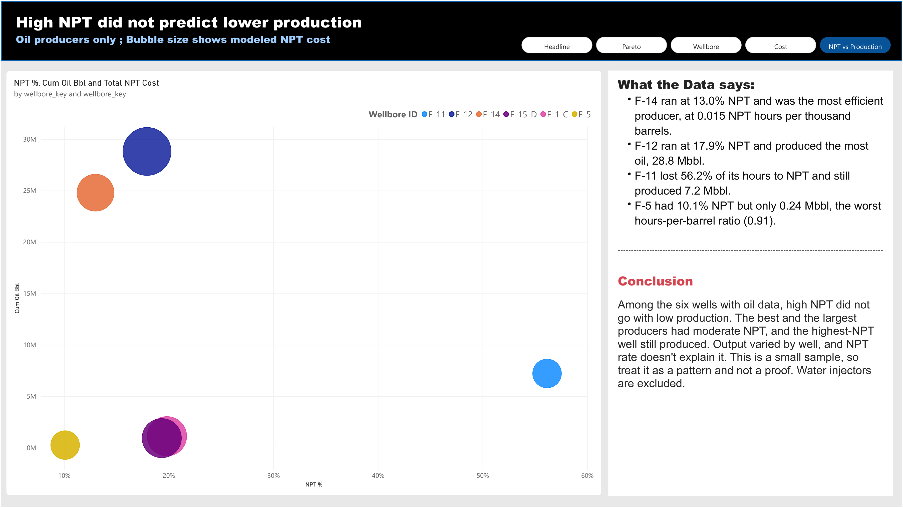

# Volve Field: Drilling NPT vs. Well Productivity

Analysis of non-productive time across the Volve drilling campaign, and whether
the wells that were hardest to drill were the wells worth drilling.

> **Status:** Complete. Phases 0-6 done: extraction, NPT classification, PostgreSQL star schema, Power BI report.

## The question

Volve's drilling campaign consumed significant non-productive time. Where did it
go, what did it plausibly cost, and did high-NPT wells deliver proportionally
higher production?

## Headline finding

About 20.0% of logged rig time (7,888 of 39,395 hours, 26 wellbores) was non-productive, and two causes,
surface-equipment repair and weather, account for 61% of it. Among the six wells with oil data, high NPT
did not go with low production.

## Stack

Python (extraction, parsing) → PostgreSQL (star schema) → Power BI (report)

## The report

Five-page Power BI report: Headline, Pareto, Wellbore, Cost, NPT vs Production.

| | |
|---|---|
|  |  |
|  |  |
|  | |

Files: [`powerbi/volve_npt.pbix`](powerbi/volve_npt.pbix) and a
[PDF export](powerbi/volve_npt_report.pdf). Full write-up:
[`docs/Volve_NPT_Project_Report.docx`](docs/Volve_NPT_Project_Report.docx).

## Reproduce

Environment and schema: [`docs/SETUP.md`](docs/SETUP.md).
Getting the data: [`docs/DOWNLOAD.md`](docs/DOWNLOAD.md).

Short version:

```bash
python3 -m venv .venv && source .venv/bin/activate
pip install -r requirements.txt
cp .env.example .env          # then edit it
psql -U volve_app -d volve -f sql/01_ddl_dimensions.sql
psql -U volve_app -d volve -f sql/02_ddl_facts.sql
python src/00_download.py --tree          # browse the Azure container
python src/00_download.py --get "<prefix>"
python src/01_inventory.py
```

## Repository layout

| Path | Contents |
|---|---|
| `src/` | Extraction, parsing, classification, load |
| `sql/` | Schema DDL, transforms, analysis queries |
| `data/reference/` | NPT taxonomy, wellbore name map — **versioned** |
| `data/raw/`, `data/interim/` | Local only, gitignored (licence) |
| `docs/` | Setup, methodology, data dictionary, full report |
| `docs/screenshots/` | Report page images |
| `powerbi/` | Power BI report (.pbix), PDF export, theme |

## Important caveats

- **Costs are modelled, not actual.** Equinor did not publish AFE data. The cost
  layer is NPT hours x an assumed $12,500 per rig-hour (see `sql/03_transforms.sql`).
  The rate is an assumption with no recorded source; absolute dollars are indicative,
  while the ranking of categories and wells is the durable result.
- **26 wellbores, six with oil data.** This is a descriptive operational review,
  not a statistical or predictive study.
- **Sidetracks are separate wellbores**, with the parent well available as a
  rollup. See the methodology note for why.

## Data licence

Volve field dataset, released by Equinor ASA and the Volve licence partners for
study, research and development purposes. See [`LICENCE-DATA.md`](LICENCE-DATA.md).
The Power BI file embeds data derived from the Volve dataset (daily drilling reports
and production volumes), shared here for educational, non-commercial portfolio use.
Source: Equinor ASA and the former Volve licence partners. Raw source files are not
included in this repository.

## Code licence

MIT — see `LICENSE`. Covers the code only, not the data.
